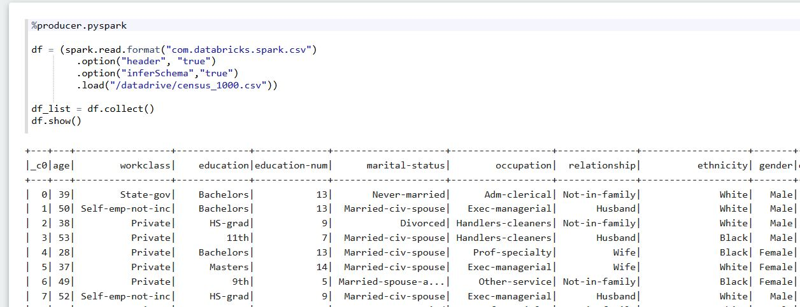
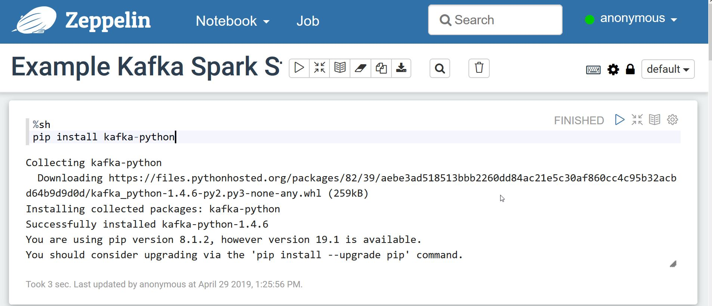
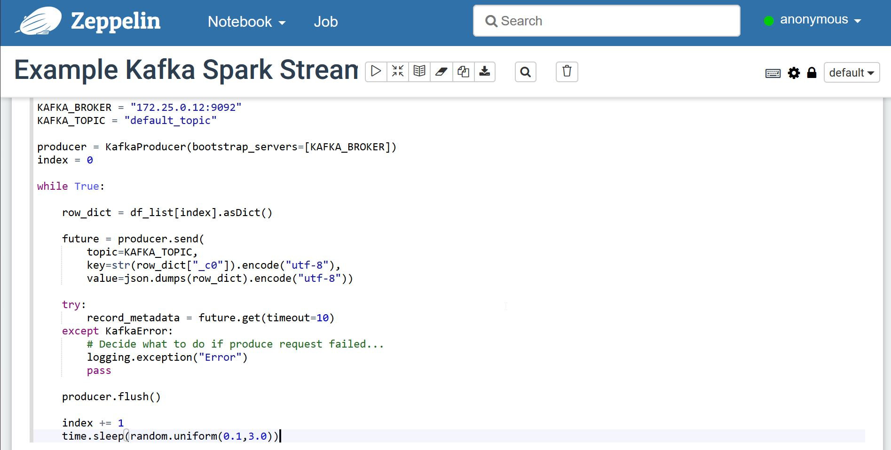

# One Click Deploy: Kafka + Spark Streaming (DStream API) + with Zeppelin UI + Zookeeper + Prometheus + Grafana + Kafka Manager

This repository contains a docker-compose stack with Kafka and Spark Streaming, together with monitoring with Kafka Manager and a Grafana Dashboard. The networking is set up so Kafka brokers can be accessed from the host.

It also comes with a producer-consumer example using a small subset of the [US Census adult income prediction dataset](https://www.kaggle.com/johnolafenwa/us-census-data).

## Detail Summary

| Container | Image | Tag | Accessible | 
|-|-|-|-|
| zookeeper | wurstmeister/zookeeper | latest | 172.25.0.11:2181 |
| kafka1 | wurstmeister/kafka | 2.12-2.2.0 | 172.25.0.12:9092 (port 8080 for JMX metrics) |
| kafka1 | wurstmeister/kafka | 2.12-2.2.0 | 172.25.0.13:9092 (port 8080 for JMX metrics) |
| kafka_manager | hlebalbau/kafka_manager | 1.3.3.18 | 172.25.0.14:9000 |
| prometheus | prom/prometheus | v2.8.1 | 172.25.0.15:9090 |
| grafana | grafana/grafana | 6.1.1 | 172.25.0.16:3000 |
| zeppelin | apache/zeppelin | 0.8.1 | 172.25.0.19:8080 |

## High level features:

<table>
<tr>
<td style="width: 50%">
<h2>Monitoring with grafana</h2>

</td>
<td>
<h2>Zeppelin UI</h2>

</td>
</tr>
<td style="width: 50%">
<h2>Kafka access from host</h2>

</td>
<td style="width: 50%">
<h2>Multiple spark interpreters</h2>

</td>
</table>


# Quickstart

The easiest way to understand the setup is by diving into it and interacting with it.

## Running Docker Compose

To run docker compose simply run the following command in the current folder:

```
docker-compose up -d
```

This will run deattached. If you want to see the logs, you can run:

```
docker-compose logs -f -t --tail=10
```

To see the memory and CPU usage (which comes in handy to ensure docker has enough memory) use:

```
docker stats
```
P.S.: Zeppelin has all the othe requirements and dependencies 

## Accessing the notebook

You can access the default notebook by going to http://172.25.0.19:8080/#/notebook/2EAB941ZD. Now we can start running the cells.

### 1) Setup

#### Install python-kafka dependency



### 2) Producer

We have an interpreter called %producer.pyspark that we'll be able to run in parallel.

#### Load our example dummy dataset

We have made available a 1000-row version of the [US Census adult income prediction dataset](https://www.kaggle.com/johnolafenwa/us-census-data).


#### Start the stream of rows

We now take one row at random, and send it using our python-kafka producer. The topic will be created automatically if it doesn't exist (given that `auto.create.topics.enable` is set to true).



### 3) Consumer

We now use the %consumer.pyspark interpreter to run our pyspark job in parallel to the producer.

#### Connect to the stream and print

Now we can run the spark stream job to connect to the topic and listen to data. The job will listen for windows of 2 seconds and will print the ID and "label" for all the rows within that window.


### 4) Monitor Kafka

We can now use the kafka manager to dive into the current kafka setup.

#### Setup Kafka Manager

To set up kafka manager we need to configure it. In order to do this, access http://172.25.0.14:9000/addCluster and fill up the following two fields:

* Cluster name: Kafka
* Zookeeper hosts: 172.25.0.11:2181

Optionally:
* You can tick the following;
    * Enable JMX Polling
    * Poll consumer information

#### Access the topic information

If your cluster was named "Kafka", then you can go to http://172.25.0.14:9000/clusters/Kafka/topics/default_topic, where you will be able to see the partition offsets. Given that the topic was created automatically, it will have only 1 partition.


#### Visualise metrics in Grafana

Finally, you can access the default kafka dashboard in Grafana (username is "admin" and password is "password") by going to http://172.25.0.16:3000/d/xyAGlzgWz/kafka?orgId=1


### Kafka-Spark Structured Streaming Code set 
https://mtpatter.github.io/bilao/notebooks/html/01-spark-struct-stream-kafka.html

